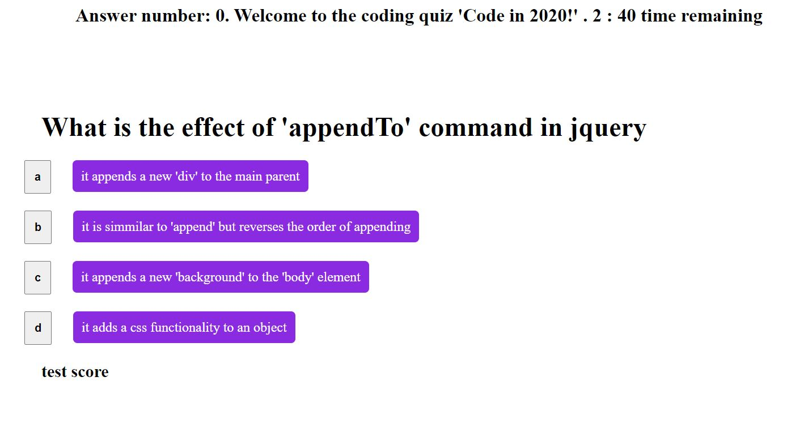
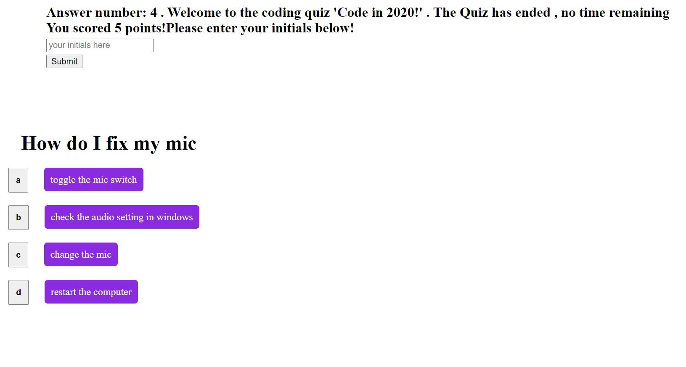
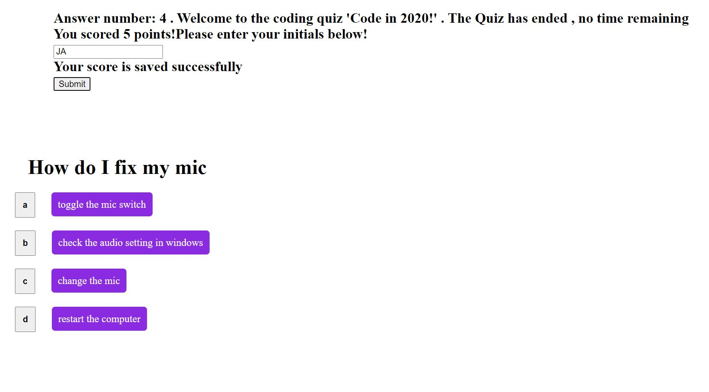

# codingQuiz
portfolio4 hw4 coding quiz
created an   array with 10 question objects
created html with 4 buttons and holders for the question info
and possible answers
made a module to process the button clicks for the user input
attached a timer to show the countdown
connected a counter for the questions to show the number of the current question
created a function to create DOM elements and populate them at the end of the quiz
created a function to collect the user info and submit it to local storrage once the submit DOM button is pressed
put several conditions to prevent the time to go in negative or the questions to show above 10.
{link to this portfolio](https://github.com/zhim57/codingQuiz)
{link to the deployed application](https://zhim57.github.io/codingQuiz/)

